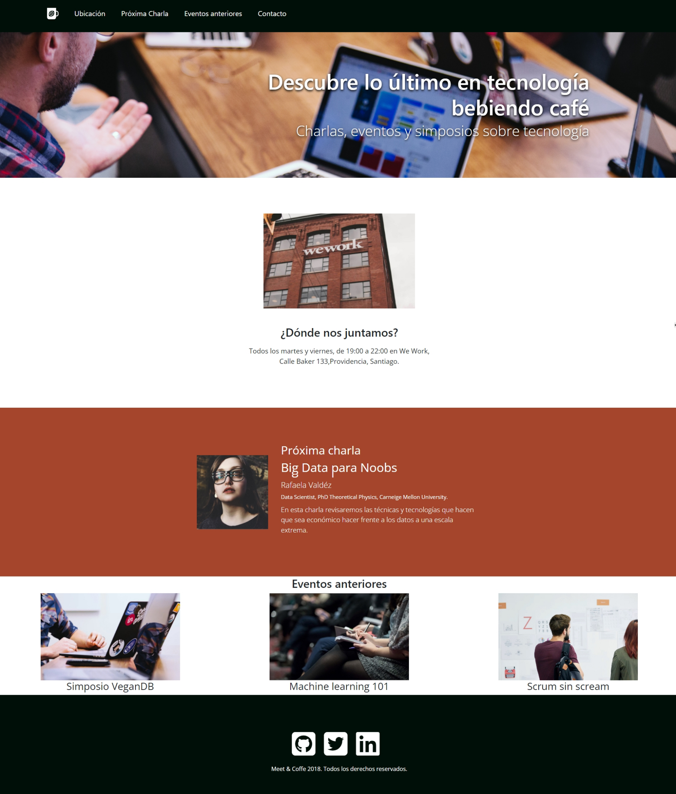

# Desafío Guiado - Meet & Coffe

Meet & Coffee es un sitio web dedicado a promover charlas, eventos y simposios sobre tecnología, donde los entusiastas pueden compartir sus conocimientos mientras disfrutan de una buena taza de café.

## Vista Codificada

A continuación, se muestra la imagen del resultado codificado:

## Estructura del Proyecto

La página está estructurada en varias secciones:

- **Menú de Navegación (`<nav>`)**: Contiene enlaces a las diferentes secciones de la página, incluyendo Inicio, Ubicación, Próxima Charla, Eventos Anteriores y Contacto.
- **Encabezado (`<header>`)**: Presenta el título y subtítulo principales de la página, destacando el tema de las charlas y eventos sobre tecnología.
- **Sección de Ubicación (`<section class="ubicacion" id="lugar">`)**: Proporciona información sobre el lugar y el horario de las reuniones.
- **Sección de Próxima Charla (`<section id="proxima-charla">`)**: Detalla la próxima charla, incluyendo el título, el ponente y una breve descripción del tema.
- **Sección de Eventos Anteriores (`<section id="eventos">`)**: Muestra una galería de eventos anteriores con imágenes y títulos.
- **Pie de Página (`<footer id="contacto">`)**: Contiene enlaces a las redes sociales y un mensaje de derechos reservados.

## Tecnologías Utilizadas
- HTML5: Para la estructura del contenido.
- CSS3: Para el diseño y estilos de la página.
- Google Fonts: Para la tipografía de la página.
- Bootstrap: Para la creación de un diseño responsivo y moderno.
- Font Awesome: Para los iconos utilizados en el pie de página.

## Autor

Este proyecto fue desarrollado por **Valeria Torrealba**.
